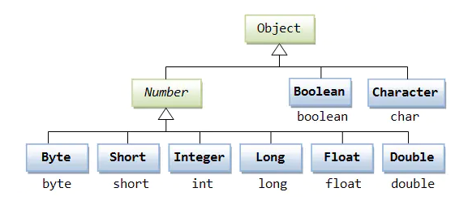
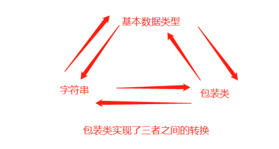
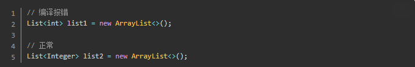
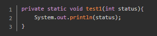
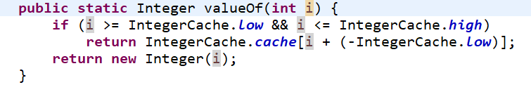
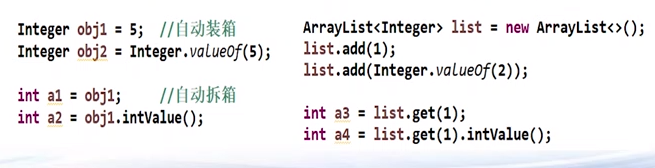

# 1.包装类


Java是面向对象的语言，但并不是“纯面向对象”的，
**因为我们经常用到的基本数据类型就不是对象。**
但是我们在**实际应用中经常需要将基本数据转化成对象**，以便于操作。比如：将基本数据类型存储到Object[]数组或集合中的操作等等。

>Java在设计类时为每个基本数据类型设计了对应的类进行代表，这样八个和基本数据类型对应的类统称为包装类(Wrapper Class)。




在这八个类中，除了Character和Boolean以外，其他的都是“数字型”，“数字型”都是java.lang.Number的子类。Number类是抽象类，因此它的抽象方法，所有子类都需要提供实现。
Number类提供了抽象方法：intValue()、longValue()、floatValue()、doubleValue()，**意味着所有的“数字型”包装类都可以互相转型。**



## 参考代码
来自如下Java工程：CommonClass->com.ethan.wrapper->WrapperTest1
来自如下Java工程：CommonClass->com.ethan.wrapper->AutoBoxTest1
来自如下Java工程：CommonClass->com.ethan.wrapper->AutoBoxTest2
## Integer为例

以下几点需要注意
1.Integer对象的几个方法:
`valueOf(),`将基本数据类型或者字符串转成包装类对象,即**装箱**
`intValue()[各种xxValue()方法]`将包装类对象转为基本数据类型，即**拆箱**
`toString()`将包装类对象转为字符串

2. 最大值最小值的原因；

## 包装类应用场景
1. 集合类泛型只能是包装类；


2. 成员变量不能有默认值；


基本数据类型的成员变量都有默认值，如以上代码 status 默认值为 0，如果定义中 0 代表失败，那样就会有问题，
这样只能使用包装类 Integer，它的默认值为 null,所以就不会有默认值影响。

3. 方法参数允许定义空值；


看以上代码，方法参数定义的是基本数据类型 int，所以必须得传一个数字过来，不能传 null，
很多场合我们希望是能传递 null 的，所以这种场合用包装类比较合适。


## 内存的分析


## 缓存的问题
int整型、char类型所对应的包装类，注意只**在这两种类型，在自动装箱时，对于-128~127之间的值会进行缓存处理，其目的是提高效率。**
缓存处理的原理为：如果**数据在-128~127这个区间，那么在类加载时就已经为该区间的每个数值创建了对象，并将这256个对象存放到一个名为cache的数组中**。
每当**自动装箱**过程发生时(或者**手动调用valueOf()时**)，就会先判断数据是否在该区间，如果在则直接获取数组中对应的包装类对象的引用，如果不在该区间，则会通过new调用包装类的构造方法来创建对象。源码如下所示：



**注意**：通过new Integer(1)这样就不会从缓存中获取，依然看源码。


## 自动装箱和自动拆箱
>通过背景了解自动装箱和拆箱！！其实属于**语法糖**的范围

了解语法糖见下面文章：
[1.语法糖.md](file:///F:/VnoteJava/2.Java高阶(新特性)/1.语法糖/1.语法糖.md)

在JDK1.5以前，这样的代码 Integer i = 5 是错误的，必须要通过Integer i = new Integer(5) 这样的语句来实现基本数据类型转换成包装类的过程;
而在JDK1.5以后，Java提供了自动装箱的功能，因此只需Integer i = 5这样的语句就能实现基本数据类型转换成包装类，这是因为JVM为我们执行了Integer i = Integer.valueOf(5)这样的操作，这就是Java的自动装箱。
自动装箱与拆箱的功能事实上是编译器来帮的忙，编译器在编译时依据您所编写的语法，决定是否进行装箱或拆箱动作。


1.自动装箱调用的是valueOf()方法，而不是new Integer()方法，new Integer()方法其实已经要废弃了。
2.自动拆箱调用的xxxValue()方法。
3.自动装箱过程是通过调用包装类的valueOf()方法实现的，而自动拆箱过程是通过调用包装类的 xxxValue()方法实现的(xxx代表对应的基本数据类型，如intValue()、doubleValue()等)。


### 注意事项

1. ==:基本类型是内容相同，对象是指针是否相同(内存同一个区域)；
2. 基本类型没有空值，对象有null，可能触发NullPointerException；
3. 当一个基础数据类型与封装类进行**==**、+、-、*、/运算时，会将封装类进行拆箱，对基础数据类型进行运算；
4. 谨慎使用多个非同类的数值类对象进行运算，举例如下；
```java
	Integer a1 = 1000;//对象
	int a2 = 1000;//基本类型
	Integer a3 = 2000;//对象
	Long a4 = 2000L;//对象
	long a5 = 2000L;//基本类型
	System.out.println(a1 == a2);  //a1拆箱之后和a1进行数值比较 true
	System.out.println(a3 == a4); //不同类型不能比较
```
**只要有一个基本类型，其他的包装类都会被拆箱，所以可以进行数值的比较 等于号==
如果都是包装类对象，==号进行比较是比较是否是同一块内存地址，不是进行数值的比较；**


## 性能问题
在参考博文中有介绍


## 总结

主要就是基本数据类型和包装类以及和字符串之间的转换。

为什么会有这样的需求是因为集合等一些操作只能存放或者操作对象，无法操作基本数据类型。


## 参考博文

[深入理解Java中的包装类与自动拆装箱](https://www.jianshu.com/p/547b36f04239)