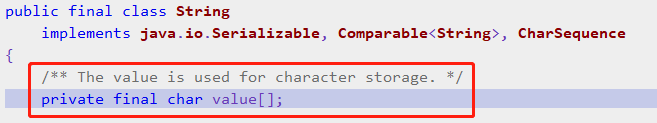

# 2.String字符串类

```java
public final class String
    implements java.io.Serializable, Comparable<String>, CharSequence
{
    /** The value is used for character storage. */
    private final char value[];

    /** The offset is the first index of the storage that is used. */
    private final int offset;

    /** The count is the number of characters in the String. */
    private final int count;

    /** Cache the hash code for the string */
    private int hash; // Default to 0

    /** use serialVersionUID from JDK 1.0.2 for interoperability */
    private static final long serialVersionUID = -6849794470754667710L;

    ........
}
```

## 核心知识点
由源码可知：

**String类是不可变字符序列。**
**String对象一旦被创建就是固定不变的了，对String对象的任何改变都不影响到原对象，相关的任何change操作都会生成新的对象”。**
什么叫做“不可变对象”呢?
指的是对象内部的成员变量的值无法再改变。


## 参考代码
来自如下Java工程：CommonClass->com.ethan.string包


## 字符串创建方式


## 字符串常用方法和源码解析


## 理解字符串常量池
我们知道字符串的分配和其他对象分配一样，是需要消耗高昂的时间和空间的，而且字符串我们使用的非常多。
JVM为了提高性能和减少内存的开销，在实例化字符串的时候进行了一些优化：使用字符串常量池。
**每当我们创建字符串常量时，JVM会首先检查字符串常量池，如果该字符串已经存在常量池中，那么就直接返回常量池中的实例引用。**
**如果字符串不存在常量池中，就会实例化该字符串并且将其放到常量池中。**
**由于String字符串的不可变性我们可以十分肯定常量池中一定不存在两个相同的字符串**（这点对理解上面至关重要）。

# 问题所在
**理解JAVA虚拟机的内存分配，这点不懂没办法理解常量池这些。全局字符串常量池，class文件常量池，运行时常量池；**


## 注意事项

**使用StringBuilder可变字符序列和不可变字符序列String时的陷阱：**
1.当循环扩展字符串时候，一定要用可变字符序列！！！
2.String s ="a"; 创建了一个字符串s = s+"b"; 
实际上原来的"a"字符串对象已经丢弃了，现在又产生了另一个字符串s+"b"(也就是"ab")。
如果多次执行这些改变串内容的操作，会导致大量副本字符串对象存留在内存中，降低效率。
如果这样的操作放到循环中，会极大影响程序的时间和空间性能，甚至会造成服务器的崩溃。
相反，StringBuilder和StringBuffer类是对原字符串本身操作的，可以对字符串进行修改而不产生副本拷贝或者产生少量的副本。因此可以在循环中使用。


