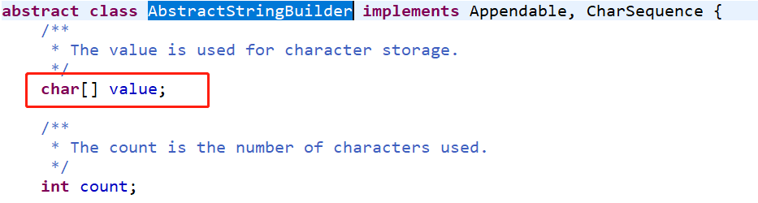

# 3.可变字符序列
相对于String类来说的。

因为两者StringBuilder和StringBuffer都是继承自AbstractStringBuilder,所以其字符数组是可变的。对比String来看。

## 参考代码
来自如下Java工程：CommonClass->com.ethan.string包

# StringBuilder和StringBuffer

>StringBuilder线程不安全，效率高，一般使用它
>StringBuffer线程不安全，效率高

## 常用方法

**记住一个链式调用；**

## 注意事项

**使用StringBuilder可变字符序列和不可变字符序列String时的陷阱：**
1.当循环扩展字符串时候，一定要用可变字符序列！！！
2.String s ="a"; 创建了一个字符串s = s+"b"; 
实际上原来的"a"字符串对象已经丢弃了，现在又产生了另一个字符串s+"b"(也就是"ab")。
如果多次执行这些改变串内容的操作，会导致大量副本字符串对象存留在内存中，降低效率。
如果这样的操作放到循环中，会极大影响程序的时间和空间性能，甚至会造成服务器的崩溃。
相反，StringBuilder和StringBuffer类是对原字符串本身操作的，可以对字符串进行修改而不产生副本拷贝或者产生少量的副本。因此可以在循环中使用。