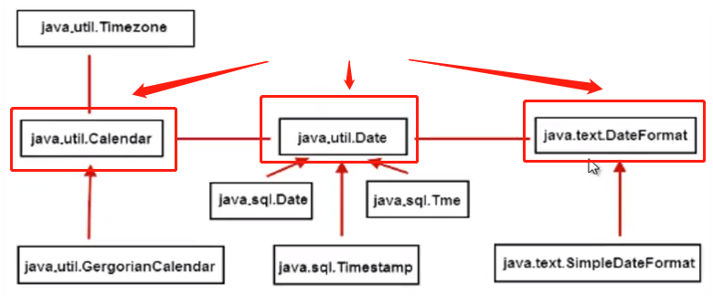

# 3.日期类综述

计算机世界是以1970年的1.1.0h.0s为基准点。
**一般使用年月日时候使用Calendar类，不建议使用该类。**
**一般使用日期跟字符串转换格式时候使用DateFormat类，不建议使用该类。**
使用 Calendar 类实现日期和时间字段之间转换，使用 DateFormat 类来格式化和解析日期字符串。Date 中的相应方法已废弃（查阅自 API 文档）
获取当前时刻的毫秒数，以long类型表示的。`long now = System.currentTimeMillis();`该时刻是我们时间日期的核心值，年月日时分秒都是根据这个值计算出来的。

简单说就是：java.util.Date 是个日期数据；java.util.Calendar 用于日期相关的计算；

## 日期类的结构

 

## 参考代码

来自如下Java工程：CommonClass->com.ethan.date包

# Date类

## 常用方法和源码解析

其内部就是以System.currentTimeMillis()为核心。

用的时候翻翻源码。

# DateFormat类

>把时间对象转化成指定格式的字符串。反之，把指定格式的字符串转化成时间对象。
DateFormat是一个抽象类，一般使用它的的子类SimpleDateFormat类来实现。

# Calendar类
 Calendar 类是一个抽象类，为我们提供了关于日期计算的相关功能，比如：年、月、日、时、分、秒的展示和计算。
GregorianCalendar 是 Calendar 的一个具体子类，提供了世界上大多数国家/地区使用的标准日历系统。

注意月份的表示，一月是0，二月是1，以此类推，12月是11。 因为大多数人习惯于使用单词而不是使用数字来表示月份，这样程序也许更易读，父类Calendar使用常量来表示月份：JANUARY、FEBRUARY等等。

# 参考博文

[尚学堂的日期讲解](https://www.sxt.cn/Java_jQuery_in_action/eight-date-simple.html)

