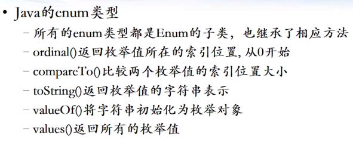

# 枚举详解

参考文章：
[Java中的枚举类型（Enum）详解1](https://zhuanlan.zhihu.com/p/51296740)
[详解Java枚举类型（Enum）中的方法](https://zhuanlan.zhihu.com/p/64604609)
[Java中枚举类型（Enum）使用进阶](https://zhuanlan.zhihu.com/p/64605561)


## 枚举解析

下面是一个很典型的枚举，代表四季的枚举。
```java
package com.ethan.test;
public enum SEASON {
	SPRING,
	SUMMER,
	AUTUMN,
	WINTER;
}
```


使用枚举一般用来替代常量JDK1.5引入了枚举
```java

package com.ethan.test;

class Season{
	private static final int SPRING = 0;
	private static final int SUMMER = 1;
	private static final int AUTUMN = 2;
	private static final int WINTER = 3;
	
}
```

Java自动给按照枚举值出现的顺序，从0开始分配了编号。通过name()可以获得枚举值的名称，通过ordinal()可以获得枚举值的编号。

## 枚举的实现原理


以上面的枚举SEASON为例，

>1.枚举SEASON在经过编译后生成了一个扩展了java.lang.Enum的类,也就是说枚举SEASON编译后的真容是Season类，并且该类是继承了java.lang.Enum；
>2.并且Season这个类是final类型的，最终类，无法在被继承；
3.我们定义的每个枚举值都是该类中的一个成员，且成员的类型仍然是Season类型，正如我们定义的SPRING,SUMMER,AUTUMN,WINTER,本质上就是Season类的对象；
4.枚举类中被默认增加了许多静态方法，例如values()，name()等；
如下图所示：即为例子的SEASON枚举编译后的本质内容：清晰明了。


我们使用enum定义的枚举类型，会在编译之后转化为一个继承了java.lang.Enum的类，
而我们定义的每个枚举值都会在类的初始化阶段被实例化为我们所定义的枚举类的一个对象。
同时，编译器还帮我们在类中增加了两个方法，分别是：values()和valueOf()。


## 枚举中的方法

枚举类实际上继承了Enum抽象类，因此Enum抽象类是所有枚举类型的基本类，下面是它的常见方法：



ordinal()方法：该方法获取的是枚举变量在枚举类中声明的顺序，下标从0开始，如日期中的MONDAY在第一个位置，那么MONDAY的ordinal值就是0，如果MONDAY的声明位置发生变化，那么ordinal方法获取到的值也随之变化，注意在大多数情况下我们都不应该首先使用该方法，毕竟它总是变幻莫测的。
compareTo(E o)方法：则是比较枚举的大小，注意其内部实现是根据每个枚举的ordinal值大小进行比较的。
name()方法与toString()：几乎是等同的，都是输出变量的字符串形式。
getDeclaringClass（）： 返回该枚举变量所在的枚举类。


## 枚举的使用

就将枚举当作正常的稍微有些特殊的类用就行了，枚举也可以建立属性，设置方法，生成构造器，

## 枚举的关键理解

>1.是一个稍微特殊的类，完全可以按照类的方式进行加属性，加方法，加构造器；
>2.比较特殊的是枚举的构造函数都是私有的，也就是说天然的单例模式，一个枚举值代表一个对象，并且唯一。
>枚举被设计成是单例模式，即枚举类型会由JVM在加载的时候，实例化枚举对象，你在枚举类中定义了多少个就会实例化多少个，JVM为了保证每一个枚举类元素的唯一实例，是不会允许外部进行new的，所以会把构造函数设计成private，防止用户生成实例，破坏唯一性。
>3.可以跟switchcase语句搭配使用，在Java7之前，switch只能支持 byte、short、char、int或者其对应的封装类以及Enum类型。在Java7中，也支持了String类型；

## 困惑点

1. 枚举是严格的单例模式吗？
一个枚举类如果有多个枚举值，那么不是单例模式
如果只有一个枚举值，则是单例模式；


