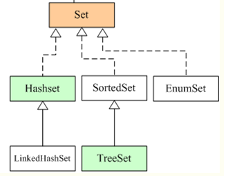

# 8.Set接口


>**特点：**
>一、无序性：不等于随机性，其底层仍然是按照数组存储(数组加链表的形式)，通过某种算法随机存在数组的某个索引下，而不是按照数组索引顺序存储。
>二、不可重复性：保证添加的元素按照equals方法进行比较后，不能返回true,即相同的元素只能添加一个，又因为底层不仅仅按照单一数组的形式存储，所以效率上很高，这个效率体现在每添加一个元素，如何比较是否是重复元素。甚至，Set中也只能放入一个null元素，不能多个。


 Set接口继承自Collection，Set接口中没有新增方法，方法和Collection保持完全一致。我们在前面通过List学习的方法，在Set中仍然适用。

## 参考代码
来自如下Java工程：JavaCollection->com.ethan.set包


## Set 接口的框架:



**Set接口: 存储无序的、不可重复的数据**
**HashSet:** 作为Set接口的主要实现类;线程不安全的:可以存储null值；
**LinkedHashSet:** 作为HashSet的子类; 遍历其内部数据时，可以按照添加的顺序进行查询，对于频繁的遍历操作，效率高于HashSet；
**TreeSet**：可以按照添加对象的指定属性，进行排序；


## HashSet

>**元素添加过程解析**
HashSet为例:
我们向HashSet中添加元素a,首先调用元素a所在类的hashCode()方法，计算元素a的哈希值，此哈希值通过某种算法计算出元素a在HashSet底层数组中的存放位置(即为:索引位置)，接着进行判断数组此位置上是否已经有元素:
/------如果此位置上没有其他元素，则元素a添加成功。
/-------------如果此位置上有其他元素b(或以链表形式存在的多个元素)，则比较元素a与元素b的hash值:
/------------------如果hash值不相同，则元素a添加成功。
/-----------------------如果hash值相同，进而需要调用元素a所在类的equals()方法:
/-------------------------------equals()返回true,元素a添加失败，equals()返回false,则元素a添加成功。|


**总结：
先哈希值判断，再equals方法判断！
哈希值不一样，肯定是不同元素
哈希值一样，equals不一样，还是不同元素
哈希值和equals都一样，是同一个元素。**


**注意: hashCode方法得到哈希值其实是根据对象的属性计算出来的，如果某个属性一样，一般来说这个属性得到的哈希值也是一样的，多个属性进行算法合并，得到这个对象的哈希值。**

**了解下**：


### 底层实现原理解析

**源码一览**

```java
public class HashSet<E>
    extends AbstractSet<E>
    implements Set<E>, Cloneable, java.io.Serializable
{
    static final long serialVersionUID = -5024744406713321676L;

    private transient HashMap<E,Object> map;

    // Dummy value to associate with an Object in the backing Map
    private static final Object PRESENT = new Object();

    /**
     * Constructs a new, empty set; the backing <tt>HashMap</tt> instance has
     * default initial capacity (16) and load factor (0.75).
     */
    public HashSet() {
        map = new HashMap<>();
    }
    public boolean add(E e) {
        return map.put(e, PRESENT)==null;
    }

```

 HashSet是采用哈希算法实现，底层实际是用HashMap实现的(HashSet本质就是一个简化版的HashMap)，因此，**查询效率和增删效率都比较高，线程不安全。**
我们发现里面有个map属性，这就是HashSet的核心秘密。
我们再看add()方法，发现增加一个元素说白了就是：
**在map中增加一个键值对，键对象就是我们要添加的这个元素，值对象是名为PRESENT的Object对象。**
说白了，就是“往set中加入元素，本质就是把这个元素作为key加入到了内部的map中”。
由于**map中key都是不可重复的，因此，Set天然具有“不可重复”的特性。**

### 疑问
hashset中的链表的形式，单向链表还是什么？跟LinkedHashSet的链表的区别。
如何查找的？遍历的原理是什么


##  LinkedHashSet

其原理是在HashSet的基础上，每添加一个元素，其实该元素就是一个链表节点，并且是双向链表，带有两个指针域的节点，所以每添加一个元素，可以按照顺序将两个元素双向连接在一起，故查询效率比HashSet高。


## 总结

当使用set时候，一定要注意添加的元素，其所在的类一定要重写两个方法，hashCode和equals方法。
以此来实现对象相等规则，**也就是说相等的对象一定要有相等的散列码。**


