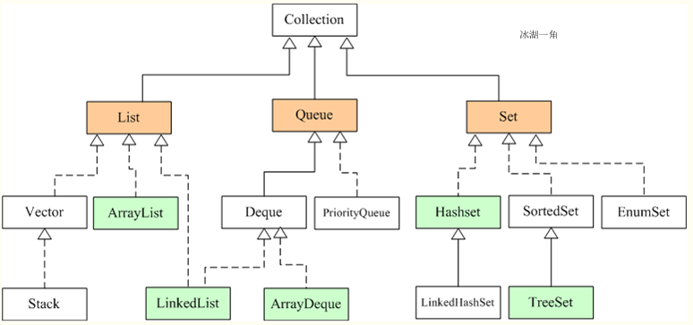
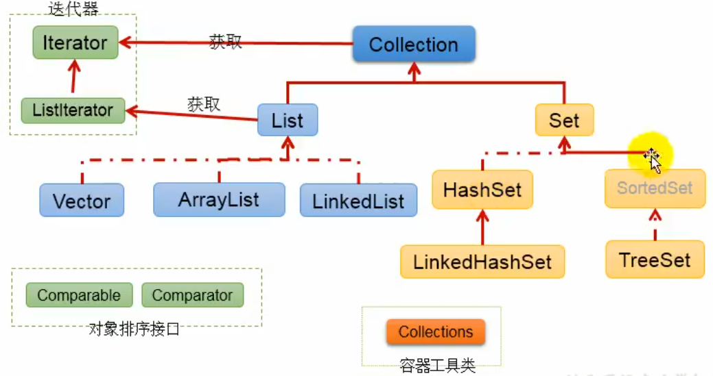
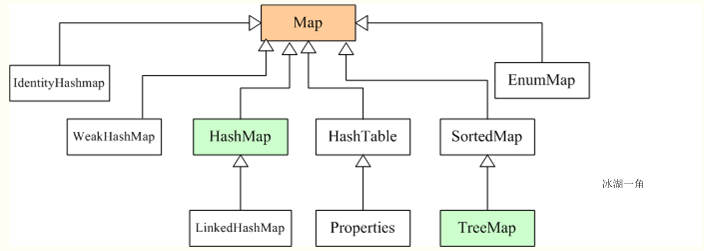
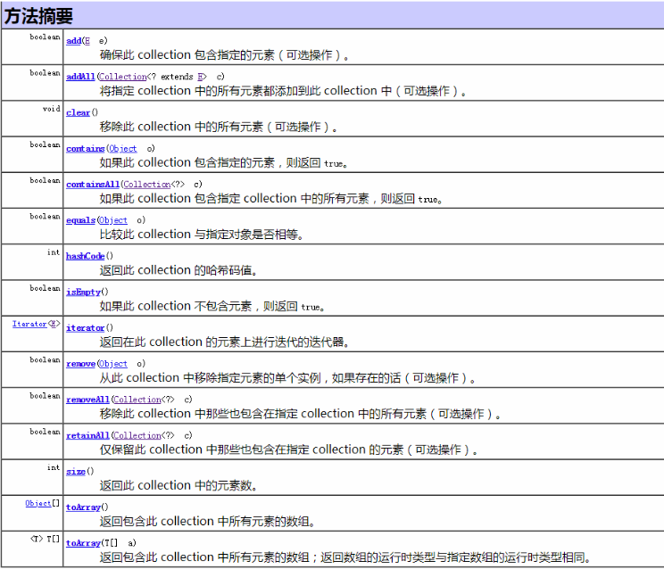

# 2.Java集合框架解析

## 集合框架图

>**Collection接口**

>**Map接口**

集合可以看作是一种容器，用来存储对象信息。所有集合类都位于java.util包下，但支持多线程的集合类位于java.util.concurrent包下。
数组与集合的区别如下：
1）数组长度不可变化而且无法保存具有映射关系的数据；集合类用于保存数量不确定的数据，以及保存具有映射关系的数据。
2）数组元素既可以是基本类型的值，也可以是对象；集合只能保存对象。

Java集合类主要由两个根接口Collection和Map派生出来的，Collection派生出了三个子接口：List、Set、Queue（Java5新增的队列），**因此Java集合大致也可分成List、Set、Queue、Map四种接口体系，（注意：Map不是Collection的子接口）。**

### 总结
**List代表了有序可重复集合，可直接根据元素的索引来访问；**
**Set代表无序不可重复集合，只能根据元素本身来访问；**
Queue是队列集合；
**Map代表的是存储key-value对的集合，可根据元素的key来访问value。**
上图中淡绿色背景覆盖的是集合体系中常用的实现类，分别是**ArrayList、LinkedList**、ArrayQueue、**HashSet、TreeSet、HashMap**、TreeMap等实现类。

## Java集合解析常见接口及实现类(概述)
>**Java集合大致可分成:**
>**1. List  （重点）**
>**2. Set  （重点）**
>**3. Queue**
>**4. Map（重点）**
>以上四种接口体系。
>**注意：Map不是Collection的子接口，是独立于Collection的。**
>**对于整个集合框架有一个大致的认知和区分**

## Collection集合

>熟悉一下 Collection接口的常用方法，其各实现类均使用这些方法进行操作；

### 1. List集合
#### 特性
　　**特点：List集合代表一个有序、可重复集合，集合中每个元素都有其对应的顺序索引。List集合默认按照元素的添加顺序设置元素的索引，可以通过索引（类似数组的下标）来访问指定位置的集合元素。**

　　实现List接口的集合主要有：ArrayList、LinkedList、Vector、Stack。

#### 1)ArrayList

ArrayList是一个**动态数组**，也是我们最常用的集合，是List类的典型实现。
它允许任何符合规则的元素插入甚至包括null。每一个ArrayList都有一个初始容量（10），该容量代表了数组的大小。随着容器中的元素不断增加，容器的大小也会随着增加。
**在每次向容器中增加元素的同时都会进行容量检查，当快溢出时，就会进行扩容操作。**
所以如果我们明确所插入元素的多少，最好指定一个初始容量值，避免过多的进行扩容操作而浪费时间、效率。
ArrayList擅长于随机访问。同时ArrayList是非同步的。

#### 2)LinkedList

LinkedList是List接口的另一个实现，除了可以根据索引访问集合元素外，LinkedList还实现了Deque接口，可以当作双端队列来使用，也就是说，既可以当作“栈”使用，又可以当作队列使用。
LinkedList的实现机制与ArrayList的实现机制完全不同，ArrayList内部以数组的形式保存集合的元素，所以随机访问集合元素有较好的性能；
**LinkedList内部以链表的形式保存集合中的元素**，所以随机访问集合中的元素性能较差，但在插入删除元素时有较好的性能。

#### 3)Vector

与ArrayList相似，但是Vector是同步的。所以说Vector是线程安全的动态数组。它的操作与ArrayList几乎一样。

#### 4)Stack

**Stack继承自Vector，实现一个后进先出的堆栈。Stack提供5个额外的方法使得Vector得以被当作堆栈使用。**基本的push和pop 方法，还有peek方法得到栈顶的元素，empty方法测试堆栈是否为空，search方法检测一个元素在堆栈中的位置。Stack刚创建后是空栈。

#### 5)Iterator接口和ListIterator接口

Iterator是一个接口，它是集合的迭代器。集合可以通过Iterator去遍历集合中的元素。Iterator提供的API接口如下：

>♦ boolean hasNext()：判断集合里是否存在下一个元素。如果有，hasNext()方法返回 true。
♦ Object next()：返回集合里下一个元素。
♦ void remove()：删除集合里上一次next方法返回的元素。

ListIterator接口继承Iterator接口，提供了专门操作List的方法。ListIterator接口在Iterator接口的基础上增加了以下几个方法：

♦ boolean hasPrevious()：判断集合里是否存在上一个元素。如果有，该方法返回 true。
♦ Object previous()：返回集合里上一个元素。
♦ void add(Object o)：在指定位置插入一个元素。
以上两个接口相比较，不难发现，ListIterator增加了向前迭代的功能（Iterator只能向后迭代），ListIterator还可以通过add()方法向List集合中添加元素（Iterator只能删除元素）。

### 2.Set集合

#### 特性
**Set集合的存储是无序的，并且元素是不重复的，不允许存储相同的元素，所以如果把两个相同元素添加到同一个Set集合，则添加操作失败**，新元素不会被加入。

**下面着重介绍Set集合几个常用实现类：**
#### 1）HashSet类

HashSet是Set集合最常用实现类，是其经典实现。HashSet是按照hash算法来存储元素的，因此具有很好的存取和查找性能。

HashSet具有如下特点：
♦ 不能保证元素的顺序。
♦ HashSet不是线程同步的，如果多线程操作HashSet集合，则应通过代码来保证其同步。
♦ 集合元素值可以是null。
HashSet存储原理如下：

　　当向HashSet集合存储一个元素时，HashSet会调用该对象的hashCode()方法得到其hashCode值，然后根据hashCode值决定该对象的存储位置。HashSet集合判断两个元素相等的标准是(1)两个对象通过equals()方法比较返回true；(2)两个对象的hashCode()方法返回值相等。因此，如果(1)和(2)有一个不满足条件，则认为这两个对象不相等，可以添加成功。如果两个对象的hashCode()方法返回值相等，但是两个对象通过equals()方法比较返回false，HashSet会以链式结构将两个对象保存在同一位置，这将导致性能下降，因此在编码时应避免出现这种情况。

　　HashSet查找原理如下：

　　基于HashSet以上的存储原理，在查找元素时，HashSet先计算元素的HashCode值（也就是调用对象的hashCode方法的返回值），然后直接到hashCode值对应的位置去取出元素即可，这就是HashSet速度很快的原因。

 　　重写hashCode()方法的基本原则如下：

 　　♦ 在程序运行过程中，同一个对象的hashCode()方法返回值应相同。

　　♦ 当两个对象通过equals()方法比较返回true时，这两个对象的hashCode()方法返回值应该相等。

　　♦ 对象中用作equals()方法比较标准的实例变量，都应该用于计算hashCode值。

#### 2）TreeSet类

　　TreeSet时SortedSet接口的实现类，TreeSet可以保证元素处于排序状态，它采用红黑树的数据结构来存储集合元素。TreeSet支持两种排序方法：自然排序和定制排序，默认采用自然排序。

　　♦ 自然排序

　　TreeSet会调用集合元素的compareTo(Object obj)方法来比较元素的大小关系，然后将元素按照升序排列，这就是自然排序。如果试图将一个对象添加到TreeSet集合中，则该对象必须实现Comparable接口，否则会抛出异常。当一个对象调用方法与另一个对象比较时，例如obj1.compareTo(obj2)，如果该方法返回0，则两个对象相等；如果返回一个正数，则obj1大于obj2；如果返回一个负数，则obj1小于obj2。

　　Java常用类中已经实现了Comparable接口的类有以下几个：

　　♦ BigDecimal、BigDecimal以及所有数值型对应的包装类：按照它们对应的数值大小进行比较。

　　♦ Charchter：按照字符的unicode值进行比较。

　　♦ Boolean：true对应的包装类实例大于false对应的包装类实例。

　　♦ String：按照字符串中的字符的unicode值进行比较。

　　♦ Date、Time：后面的时间、日期比前面的时间、日期大。

　　对于TreeSet集合而言，它判断两个对象是否相等的标准是：两个对象通过compareTo(Object obj)方法比较是否返回0，如果返回0则相等。

 　　♦ 定制排序

　　想要实现定制排序，需要在创建TreeSet集合对象时，提供一个Comparator对象与该TreeSet集合关联，由Comparator对象负责集合元素的排序逻辑。

　　综上：自然排序实现的是Comparable接口，定制排序实现的是Comparator接口。（具体代码实现会在后续章节中讲解）

#### 各Set实现类的性能分析

　　1. HashSet的性能比TreeSet的性能好（特别是添加，查询元素时），因为TreeSet需要额外的红黑树算法维护元素的次序，如果需要一个保持排序的Set时才用TreeSet，否则应该使用HashSet。

　　2. LinkedHashSet是HashSet的子类，由于需要链表维护元素的顺序，所以插入和删除操作比HashSet要慢，但遍历比HashSet快。

　　3. EnumSet是所有Set实现类中性能最好的，但它只能 保存同一个枚举类的枚举值作为集合元素。

　　以上几个Set实现类都是线程不安全的，如果多线程访问，必须手动保证集合的同步性。

## Map集合

### 特性
Map接口采用键值对Map<K,V>的存储方式，保存具有映射关系的数据，因此，Map集合里保存两组值，一组值用于保存Map里的key，另外一组值用于保存Map里的value，key和value可以是任意引用类型的数据。key值不允许重复，可以为null。如果添加key-value对时Map中已经有重复的key，则新添加的value会覆盖该key原来对应的value。常用实现类有HashMap、LinkedHashMap、TreeMap等。

## 参考博文

[Java集合框架总览](https://www.cnblogs.com/bingyimeiling/p/10255037.html)