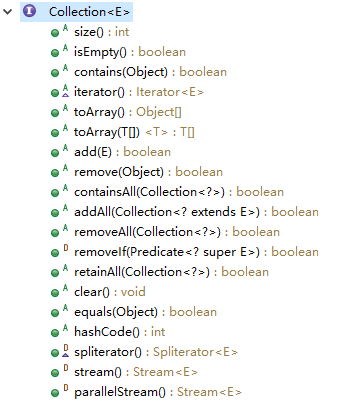

# 3.Collection接口
>**其实集合存的都是对象地址，而不是对象本身；**

>Collection结构和方法

## 参考代码

来自如下Java工程：JavaCollection->com.ethan.collection->CollectionTest1
来自如下Java工程：JavaCollection->com.ethan.collection->CollectionTest2

## 常用方法注意事项
**`add(),remove(),isEmpty(),size()`最基本的四个方法；**
**注意**：
1. add方法添加的是已经存在的元素的对象，也就是add里面的元素是已经存在的了，add的也只是元素对象的地址；
2. remove方法同理，只是把对象的地址拿出去了，不代表该元素对象直接被删除了，该对象依然存在，只不过不在该集合里面了。

**equals()方法**
根据equals()来判断contains()	，元素是否是相等的；

### 解析equals()
**重点**:Collection中所有涉及到比较和判断的方法，其实都是调用了其equals方法进行判断的,取决于你的equals方法是进行对象的判断还是内容的判断。
**向Collection接口的实现类中添加obj元素时候，要求obj所在类实现equals方法。原因如上。如果你没有重写实现equals方法，那么其实还是调用的是equals方法，只不过是调用的是根类Object类的equals方法，该方法众所周知，只是判断是不是同一个对象。**
提示：一般来说equals方法的原则是判断是否是同一个对象，或者是同一个类的不同对象，内容是否相同。

### 迭代器Iterator
用来遍历集合中的元素
[4.迭代器Iterator.md](file:///F:/VnoteJava/1.Java基础/集合全解/4.迭代器Iterator.md)

## 总结

Collection的方法基本包含了List和Set的大部分方法；