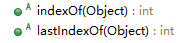
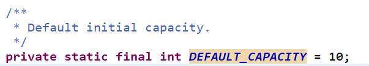
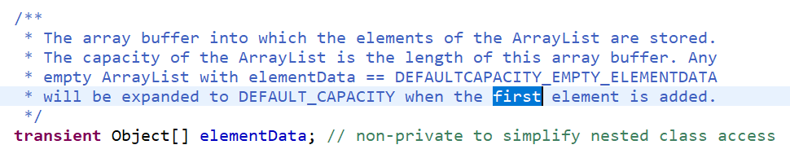
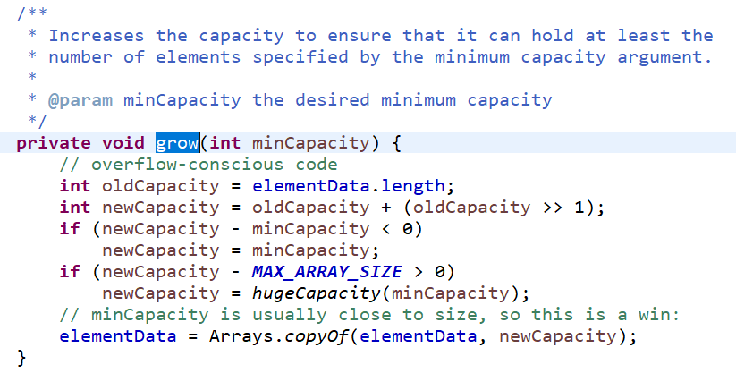

# 3.List-ArrayList

## 参考代码


来自如下Java工程：JavaCollection->com.ethan.list->*
来自如下Java工程：JavaCollection->com.ethan.arraylist->*
## List

### 特性
1. 有序
每个元素都有其对应的顺序索引。List集合**默认按照元素的添加顺序设置元素的索引**，可以通过索引（类似数组的下标）来访问指定位置的集合元素
2. 可重复
加入的元素可以重复，即**允许e1.equals(e2)的元素重复加入**进来；


### List相比Collection多的方法

List相比Collection多的方法也反应了List的**特性**。





## 常用方法

```
void add(int index, object ele): 在index位置插入ele元素
boolean addAll(int index, collection eles): Mindex位置开始将eles中的所有元素添加
object get(int index): 获取指定index位置的元素
int index0f(0bject obj): 返回obj在集合中首次出现的位置
int LastIndexOf(Object obj): 返回obj在当前集合中末次出现的位置
0bject remove(int index): 移除指定index位置的元素，并返回此元素
object set(int index, object ele):设置指定index位置的元素为ele
List sublist(int fromIndex, int toIndex): 返回从fromIndex到toIndex位置的子集合

```

```java
总结:常用方法
增:add(object obj)
删: remove(int index) / remove(object obj)
改: set(int index, object ele)
查: get(int index)
插: add(int index, object ele)
长度: size()
遍历: 	
	①Iterator迭代器方式
	②增强for循环
	③普通的循环
	
```


## ArrayList
### 特点
底层是数组实现的，查询效率高，增删效率低，线程不安全，一般使用这个；

### 重点
一般数据是直接定义好容量的，是有限的，但是ArrayList可以存放任意数量的对象，长度不受限制，实现原理如下：
当预设的10容量的内存用完之前，会新生成一个新的更大的数组来将原数组数据复制过来，这样无限扩容。
elementData数组就是我们的底层实现的数组，看注释！！



该方法grow进行了扩容操作



## ArrayList源码分析


