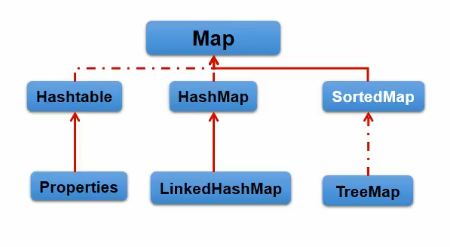

# 9.Map
**双列数据，存储key-value对的数据。**

一，**HashMap** :作为Map的主要实现类;线程不安全的，效率高;可以存储null的key和value，底层实现原理:数组和链表搭配。
/------------ **linkedHashMap**:HashMap的子类，保证在遍历map元素时，可以按照添加的顺序实现遍历。原因:在原有的HashMap底层结构基础上，添加了-一对前后指针域，指向前一个和后一 个元素。对于频繁的遍历操作，此类比HashMap效率高。
二，**TreeMap**:类似于treeSet，可以保证按照添加的key-value进行排序，实现排序遍历。此时考虑的是key值的自然排序或定制排序。底层是红黑树。
三，**Hashtable**：作为古老的实现类;线程安全的，效率低;不能存储null的key和value
/------------**Properties**:常用来进行处理配置文件，他的key和value都是String类型的。

## Map结构的理解

一个键值对其实构成了一个Entry对象，Entry对象里面包含了key和value两个属性。
**注意只要是无序不可重复的，也就意味着要重写元素的类两个方法hashCode和equals**

