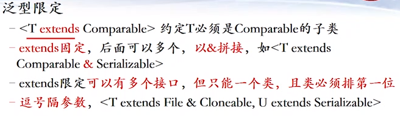
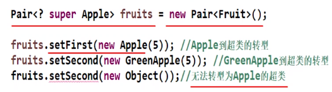

# 泛型

## 概念
**泛型:编写的代码可以被很多不同类型的对象所重用**，分为三类：
**泛型类**: ArrayList, HashSet， HashMap等
**泛型方法**: Collections.binarySearch, Arrays.sort 等
**泛型接口**: List, Iterator等


>泛型的本质就是将各种变量类型参数化，避免了进行类型转换，代码复用性提高，
>也就是说比如一个方法只能穿进去int类型的变量，并且只能比较int值类型之间的大小，
>如果你传进去double类型该方法要么会警报要么会运行达不到预期，当然你可以进行类型转换，这样很显然不便捷，
>更甚至如果你想比较字符串类型的变量大小，你无法进行类型转换，会报错，你只能去重写一个能够比较字符串大小的方法，代码的复用性就降低了，
>此时就是泛型的好处体现出来了，变量类型随意，均可使用，并且还能校验你的变量是否正确。

## 泛型类

具有泛型变量的类。在类名后用<T>代表引入类型
●	多个字母表示多个引入类型，如<T,U>，<K,V>等；
●	引入类型可以修饰成员变量也就是类变量，局部变量，参数，返回值；
●	没有专门的template关键字，一般自定义用<T>;

## 泛型方法

具有泛型参数的方法，也就是说该方法的参数是带有泛型的。
该方法可在普通类/泛型类中
<T>在修饰符后，返回类型前；这句话这样理解：如果一个方法也需要加入泛型，那么这个泛型方法有个规则就是要在方法的修饰符和返回值之间加入泛型符号，这样才能代表这个方法是泛型方法，举例如下：
```java
public static <T> Interval<T> getReverse (Interval<T> interva1) {
	return new Interval<T> (interval. getupper()，interval .getLower());
}
static后面的<T>就是代表泛型方法的泛型修饰。
```
## 泛型接口

和泛型类相似，在接口名后加<T>
T用来指定方法返回值和参数，同泛型类类似；
实现接口时需要将泛型符号指定为具体的类型，举例：
```java
//定义一个泛型接口
public interface Calculator<T> {
	public T add(T operand1, T operand2);
}

//一个类实现了上面接口，需要将实现的接口的泛型符号具体化

public class IntegerCalculator implements Calculator<Integer> {
	public Integer add(Integer operand1, Integer operand2) {
		return operand1 + operand2;
	}
}

```
## 自定义泛型就省略了。


## 泛型类型限定

编写的代码可以被很多不同类型的对象所重用
**特定场合下，需要对类型进行限定(使用某些特定方法)**

```java
public static <T extends Comparable> T getMin(T... a) {
	if (null == a||a.length <=0) {
		return null;
	}
	T min=a[0];
	for (int i = 1; i < a.length; i++) {
		if (min.compareTo(a[i]) > 0) {
			min = a[i];
		}
		return min;
	}
}
```
如上述代码所示，我们需要其参数能够调用其比较大小的方法，也就是说参数必须实现 Comparable的compareTo方法,
这就意味着限制了泛型参数类型不是任意的，必须是满足extends Comparable.


注意，**这里extends是固定的，在这里不仅仅代表继承的含义，也代表限制参数类型的含义，**
你看Comparable是个接口，类应该是实现接口，而不是继承，这里用extends如果解释为继承显然不合适。

### 上限界定符
上限界定符，`Pair<? extends S>`Pair能接收的参数类型，是**S自身或子类**；
举例`List<? extends Person>`和普通的`List<T>`

Pair<? extends S>, Pair能接收的参数类型，是S自身或子类
>这点不完全理解:只能get/不能set， **编译器只能保证出来的类型，但不保证放入的对象是什么类型**
所以有下限界定符
### 下限界定符


下限界定符，Pair<? super S>，
Pair能接收的类型参数，是S的自身或超类，（这点其实是有点误解的）这个超类也是有限定的，比如下面的例子：
你加入S自身也就是Apple类没问题，加入GreenApple(该类是Apple的子类)类，但是该类可以转型为Apple类或者其父类，所以也可以；
但是Object类是Apple类的父类的父类，可不是Apple的父类，不要理解错了，所以Object类是无法转为Apple或者其父类的，也就是不行。
Pair<? super Apple>代表Pair<Object>, Pair<Fruit>, Pair<Apple>等
你其实放进去S的子类或者本身是没有一点问题的，但是你放进去S的超类是有可能出现问题的。会出现类型转换错误。



>这点不完全理解：只能set/不能get，编译器保证放入的是S本身或超类，但不保证出来是什么具体类型


## 原则


