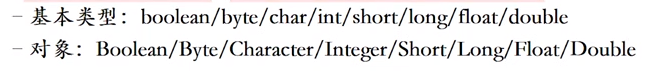

# 1.语法糖


指在计算机语言中添加的某种语法，这种语法对语言的功能并没有影响，但是更方便程序员使用。简而言之，语法糖让程序更加简洁，有更高的可读性。
具体来说，语法糖是指语言中的一个构件，当去掉该构件后并不影响语言的功能和表达能力。例如，C语言中的标记a[i]就是*(a+i)的语法糖。
 实际上从面向过程到面向对象也是一种语法糖啊，C语言可以通过它的指针、类型转换，结构实现面向对象的编程风格

## 参考来源

[语法糖详解](https://blog.csdn.net/w372426096/article/details/80507783?utm_medium=distribute.pc_relevant.none-task-blog-BlogCommendFromBaidu-1&depth_1-utm_source=distribute.pc_relevant.none-task-blog-BlogCommendFromBaidu-1)


[中国大学Mooc课程](https://www.icourse163.org/learn/ECNU-1206500807?tid=1206823217#/learn/content?type=detail&id=1212066173&cid=1215235097&replay=true)


## for-each循环

[5.增强foreache循环.md](file:///F:/VnoteJava/1.Java基础/集合全解/5.增强foreache循环.md)

[遍历集合的方法总结.md](file:///F:/VnoteJava/1.Java基础/集合全解/遍历集合的方法总结.md)


## 枚举变量
枚举是JDK5加入的，也属于语法糖，详细的解析看下面的链接：

[枚举详解.md](file:///F:/VnoteJava/1.Java基础/枚举/枚举详解.md)


## 不定项参数(可变参数)

尽量少用，注意调用时候的优先级

```java
package sugar.variablearguments;

public class VariableArgumentTest {

	public static void main(String[] args) {
		print();
		print("aaa");
		print("aaa", "bbb");
		print("aaa", "bbb", "ccc");

	}
	
	public static void print(String... args) {
        System.out.println(args.length);
        for (String arg : args) {
            System.out.println(arg);
        }
    }
	
	//当只有一个参数时，本方法优先级更高
	public static void print(String s)
	{
		 System.out.println("I am another method");
	}
	
	//错误：一个方法不可以有多个可变参数
//	public static void print(String... args, int... irgs) 
//	{
//        
//  }
	
	//错误：一个调用语句不能同时有2个带可变参数的方法适配
	//也就是说，当一个语句调用了一个函数，但是该函数的实现有两个带可变参数的方法都满足，会报错。
//	public static void print(String s1, String... args)
//	{
//		
//	}

}

```

 
## 静态导入
JDK5引入的

importstatic导入一个类的静态方法和静态变量，然后使用时候就可以不用写该类的名字，直接写静态的变量或者方法；
**注意**
1. 少使用*通配符，不滥用，最好具体到静态变量或方法；
2. 静态方法名具有明确特征，如有重名，需要补充类名；


下面是简单例程：

```java
package sugar.importstatic;

import static java.lang.Math.pow;
import static java.lang.Math.sqrt;
import static java.lang.System.*;
import static java.lang.System.out;

public class ImportStaticTest {
	public static void importMath()	{
		int a=3, b=4, c=0;
		c = (int) sqrt(pow(a,2)+pow(b,2));//静态导入的使用
		c = (int) Math.sqrt(Math.pow(a,2)+Math.pow(b,2));//非静态导入的使用
		out.println("c is " + c);
		System.out.println("c is " + c);		
	}
}


//public static void main(String[] args) {
//	importMath();
//}
```


## 自动装箱和拆箱
JDK5引入，**用来简化基本类型和对象转换的写法。**



[1.包装类和自动装箱拆箱.md](file:///F:/VnoteJava/1.Java基础/常用类/1.包装类.md)


## 多异常并列

## 数字中加入下划线

增加可读性


## 接口方法相关
在jdk1-7时，我们知道jdk的接口是没有具体实现方法的，但是到了JDK8，因为一些设计原因，接口可以有具体的实现方法。

**JDK8的接口中的默认方法和静态方法都是可以带实现的，为Lambda表达式提供支持。**

### 默认方法

可以传给子类和子接口；


**规则**
接口的默认方法
以default关键字标注(这里的default跟封装中的意义不一样)，其他的定义和普通函数一样
规则1:默认方法不能重写Object中的方法
规则2:实现类可以继承/重写父接口的默认方法
规则3:接口可以继承/重写父接口的默认方法
规则4:当父类和父接口都有(同名同参数)默认方法，子类继承父类的默认方法，这样可以兼容]DK7及以前的代码
规则5:子类实现了2个接口(均有同名同参数的默认方法)，那么编译失败，必须在子类中重写这个default方法


### 静态方法

Java8的接口中的静态方法是可以带实现的。
>**注意**：
**接口中的静态方法是只属于接口自身的，不属于子类和子接口的；
子类和子接口是没有继承该方法的，只能通过所在的接口名来调用；**

### 私有方法

**Java9接口的私有方法(带实现的)**
解决多个默认方法/静态方法的内容重复问题
私有方法属于本接口，只在本接口内使用，不属于子类/子接口
子类(子接口)没有继承该私有方法，也无法调用
静态私有方法可以被静态/默认方法调用，非静态私有方法被默认方法调用


### 总结
接口的默认方法:可以传给后代的类/接口的，且可以使用;
接口的静态方法:只属于当前接口，不会传给后代的类/接口，外部只能通过接口名.静态方法名来调用;
接口的私有方法:只属于当前接口，不会传给后代的类/接口，外部无法调用接口的私有方法，只能在当前接口内使用。
1.默认方法可以调用非静态/静态私有方法。
2.静态方法只能调用静态私有方法。
3.所有私有方法只能在当前接口内使用。

### 比较一下抽象类和接口


