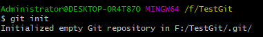
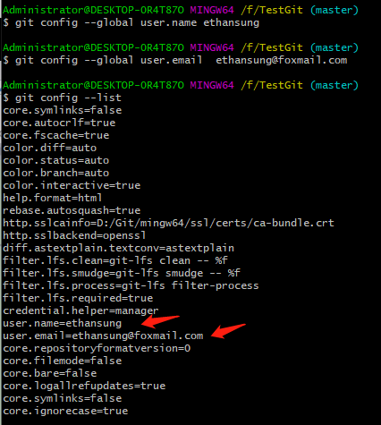
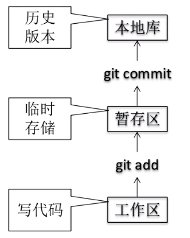

# 1.入门和基础
主要内容:
    1. Git的安装；
    2. 本地库的初始化；
    3. 相关的本地配置操作；


# Git的安装
 >略

# 本地库的初始化

>将当前文件夹初始化为本地库。
```java
git init
```


# 设置签名
>其实就是配置下用户名和email，用来区分不同的开发人员。 
```
git config --global user.name ethansung
git config --global user.email  ethansung@foxmail.com
```



# 基础命令
首先看一下本地的版本结构：



## 1.将文件被git追踪/将文件添加到暂存区
### git add
将工作区可能增加的文件，修改的文件，删除的文件，将这些修改添加到暂存区。
从没有被add的文件也就是没有被git追踪到的，必须git add之后才能够被版本控制。
```
git add readme.md
```

## 2.将暂存区的文件提交到本地库上。
### git commit
```
git commit -m "添加第一个文件readme.md"
```

## 3. 查看当前工作区和暂存区的文件状态
### git status
```
git status
```
一波最基础的三连操作：


