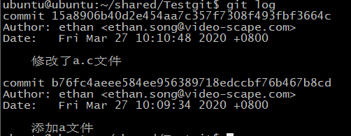
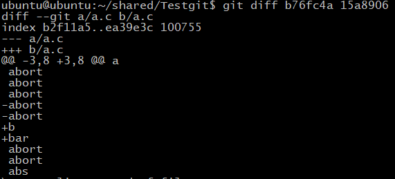
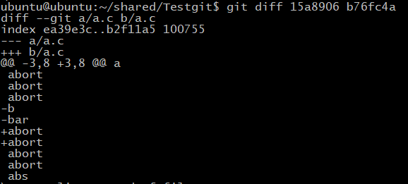

# 10.深入理解git diff

### 比较工作区和暂存区的差异

```
git diff  filepath 工作区与暂存区比较
```
**会对比出工作区的该文件与暂存区的该文件相比，做了哪些修改，其中a代表暂存区，b代表工作区**

### 比较本地库和工作区某同一文件的差异

```
git diff HEAD Filepath/filename
```
**会对比出工作区的该文件与本地库的该文件相比，做了哪些修改，其中a代表本地库，b代表工作区**
### 暂存区和本地库的差异
```
git diff --cached filename
```
**会对比出暂存区的该文件与本地库的该文件相比，做了哪些修改，其中a代表本地库，b代表暂存区**

### 查看某两个版本的差异
注意这是对比本地库不同版本的差异，
```
git diff 版本a哈希值  版本b哈希值
```


## 深入理解git diff 
首先我们需要知道，git用的是合并格式的对比。
### 查看某两个版本的差异
注意这是对比本地库不同版本的差异，
```
git diff 版本a哈希值  版本b哈希值
```
举例：
1. 为本地库添加了一个a.c文件，内容如下：
```
a
a
abort
abort
abort
abort
abort
abort
abort
abs
```
2.将a.c文件的6 7行改为如下内容，提交到本地库；
```
a
a
abort
abort
abort
b
bar
abort
abort
abs
```
3.此时查看`git log`，注意版本：



4.输入命令`git diff b76fc4a 15a8906`,也就是`git diff 版本a哈希值  版本b哈希值`;
我们这时候是`git diff 老版本 新版本`老版本在前，新版本在后。


**就该显示的分析diff信息的含义：**
>--- a/a.c    其中---表示变动前的文件
>+++ b/a.c +++表示变动后的文件
>@@ -3,8 +3,8 @@ a 
>   -3,8代表变动前的a.c文件的第3行往后连续8行的内容
>   +3,8代表变动后的a.c文件的第3行往后连续8行的内容


> 因为上述的内容显示是以合并的格式，所以理解为：

```
改动前的文件(此时其实就是指老版本的a.c文件)的第3行开始往后8行的内容：
 abort
 abort
 abort
-abort
-abort
 abort
 abort
 abs
```
与实际是相符合的。

 ```
 改动后文件（此时指的是新版本的a.c文件）第3行开始往后8行的内容：
 abort
 abort
 abort
+b
+bar
 abort
 abort
 abs
 ```
除了有变动的那些行以外,也是上下文各显示3行.它将两个文件的上下文,合并显示在一起,所以叫做"合并格式".
每一行最前面的标志位,空表示无变动,减号表示第一个文件删除的行,加号表示第二个文件新增的行.


上面的例子刚好是`git diff 老版本 新版本`老版本在前，新版本在后。是我们常用的比较方式；
以下的例子是新版本在前，老版本在后，自己分析一下你就会发现，版本文件内容的差异其实就是后面的相对前面的改变，
`git diff m版本 n版本`就是m为下图的a，当作改动前版本，n为改动后版本b
`git diff n版本 m版本`就是n为下图的a，当作改动前版本，m为改动后版本b
自己当作例子分析下吧！



