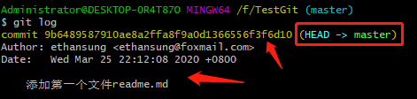
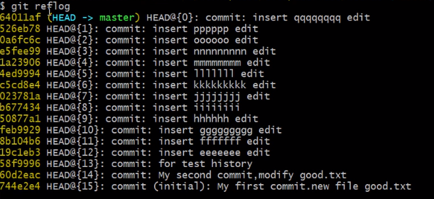
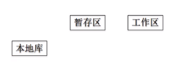
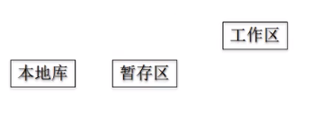

# 2.版本的穿梭
主要内容:
1. 查看提交的版本信息
2. 版本回退


## 查看提交的版本记录
### git log
查看我们`git commit` 过的版本信息，从而能够让我们知道每个版本的变化，以及我们需要回退到哪个版本。
**git log不能察看已经删除了的commit记录，比如我们当前版本为0是最新的，回退到版本3，那么1和2的记录就看不到了。**
```
git log
git log --pretty=oneline
git log --oneline
```
了解以下`git log`之后给出的信息：



### git reflog（重要）
这个命令更多的是帮助我们修正我们本地的一些提交错误，也是可以查看提交版本记录的。
**所有操作记录（包括已经被删除的 commit 记录和 reset 的操作）都可以被该命令记录到。**

```
git reflog
```
注意`HEAD@{n}`,可以帮助你回退版本。n=0代表是你当前最新版本。如果你想回退一个版本，那就n=1，对应哈希值为526eb78


>了解什么是版本号的索引值，也就是每个版本的哈希值前7位，
>什么是HEAD头指针。

**该命令是属于本地的，也就是说该命令存储的都是你自己的本地操作，不涉及到远程库别人的提交操作。（存疑）**
至于这点，想象如下场景：你把远程库的项目克隆下来，`git log` 你会发现一系列的提交历史 别人的的提交。但是你用`git reflog`就会发现没什么提交历史，应该就是因为git reflog全是你自己的提交。


## 版本回退和移动
其实我们git如何让我们进行版本的移动就是靠HEAD这个指针，移动到某个版本。
### git reset --hard 哈希值
>通过各个版本的哈希值进行版本的移动，推荐这种
```
git reset --hard 索引值(哈希值)
```
>通过HEAD^和HEAD~n回退版本，不建议使用
```
git reset --hard HEAD^^^^//回退四个版本
git reset --hard HEAD~n//回退n个版本
```


### 分析reset命令的三个参数
1. soft
```
git reset --soft 哈希值
```
>仅仅在本地库移动HEAD指针
```
这种回退版本最温和，想象一下，你当前版本的代码你在工作区已经改了大量的代码，并且也有一些add操作，一些文件的增改放到了暂存区
而你的本地库的代码还是没有改变的，和当时提交的状态一样，所以你可以想象当你用soft回退版本时候，会尽可能小的引起冲突，基本不会有冲突
当你回退之后你的工作区和暂存区的工作(修改和add的代码文件)是没有被重置/覆盖的，
你可以将你工作区和暂存区的修改和本地库进行对比，可以最大程度的降低你因为版本改变回退造成的工作的损失，
将你的暂存区和工作区的工作给覆盖掉是hard参数。非常粗暴硬核。
```
举例：



假设本地库和暂存区和工作区都是clean的，此时三个区的版本都是`HEAD@{0}`那么你用soft参数回退一个版本，那么此时的三个区域的状态如上：
本地库内容回滚到上一次提交的状态,本地库为`HEAD@{1}`版本；
暂存区内容还是`HEAD@{0}`版本的内容，
工作区内容也是`HEAD@{0}`版本的内容，


2. mixed
```
git reset --mixed 哈希值
```
>1. 将本地库的代码回退，移动了HEAD指针
>2. 重置了暂存区的修改
```
比着soft稍微硬核一点，因为它重置了暂存区。
```


举例：



假设本地库和暂存区和工作区都是clean的，此时三个区的版本都是`HEAD@{0}`那么你用mixed参数回退一个版本，那么此时的三个区域的状态如上：
本地库内容回滚到上一次提交的状态,本地库为`HEAD@{1}`版本；
暂存区如果你有提交，应该会显示有冲突，然后也会被重置回`HEAD@{1}`版本的内容，和本地库一致；
工作区内容不会动，原来啥样现在还是啥样；

3. hard（最常用）
```
git reset --hard 哈希值
```
>1. 将本地库的代码回退，移动了HEAD指针
>2. 重置了暂存区的修改
>3. 重置工作区的修改

```
如果你当前的工作和你的本地库已经不一致了，那么你用hard参数进行版本的改变，肯定会引起冲突。
```


```
测试下几个版本之后，你工作区修改一些文件，将版本回退是什么样子，是否是覆盖修改，将代码回退到你想要的那个版本
```


