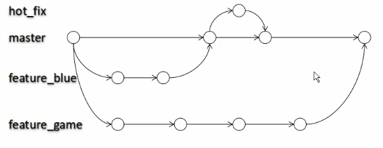

# 5.分支的管理

分支可以同时推进几个功能的开发。



**我们一般都是有主master分支和很多feature分支，所以我们都是将feature分支合并到master分支。**


## 分支操作

### 创建分支
```
git branch branchName
创建了branchName分支
```
### 查看分支
```
git branch -v
查看所有分支
```

### 切换分支
```
git checkout branchName
切换到branchName分支
```
### 合并分支
>合并分支需要注意：
>1. 首先需要切换到主分支，也就是要更新的分支，多数情况就是主分支；
>2. 合并feature分支到我们的主分支；
>3.会出现冲突，按照实际情况进行冲突的修改和合并；

```
1.git checkout masterBranchName
2.git merge featureBranchName
```


