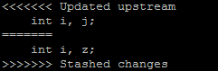

# 6.合并解决冲突

需要沟通解决 合并文件 然后提交


>**Git pull遇到错误：error: Your local changes to the following files would be overwritten by merge:**

解析：你本地工作区做了一些修改，现在你git pull 会导致你本地的修改被服务器的代码覆盖掉，如果你不想把本地工作区修改的代码被覆盖，那如下操作：
```
git stash    //暂存当前正在进行的工作。本地的修改会被保存起来，
git pull origin master   //拉取服务器的代码
git stash pop   //合并暂存的代码
```
git stash: 备份当前的工作区的内容，从最近的一次提交中读取相关内容，让工作区保证和上次提交的内容一致。同时，将当前的工作区内容保存到Git栈中。

git pull:拉取服务器上的代码，经过第一步的git stash,这时候不会引起冲突，并且把远程库代码pull下来了

git stash pop: 从Git栈中读取最近一次保存的内容，恢复工作区的相关内容。由于可能存在多个Stash的内容，所以用栈来管理，pop会从最近的一个stash中读取内容并恢复。

git stash pop可能会出现：
```
Auto-merging c/environ.c
CONFLICT (content): Merge conflict in c/environ.c
```
意思就是系统自动合并了修改的内容，但是其中有冲突，需要你手动解决其中的冲突。
打开冲突的文件，会看到类似如下的内容：


其中Updated upstream 和=====之间的内容就是pull下来的内容，
====和stashed changes之间的内容就是本地修改的内容。
碰到这种情况，git也不知道哪行内容是需要的，所以要自行确定需要的内容。


