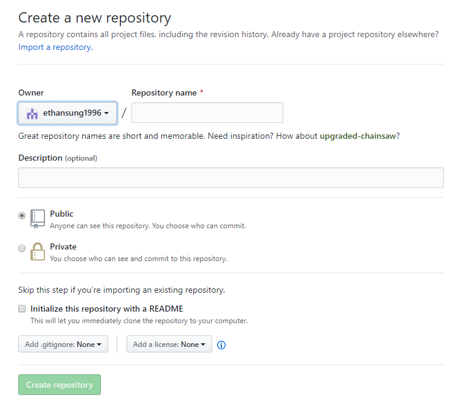
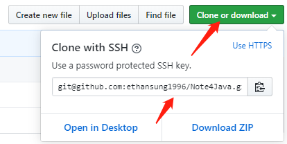

# 8.Git和Github
**如何将Git本地库推送到Github，两者建立连接，形成个人云笔记**
# Git
## 初始化本地库
```
git init
```
## 添加忽略文件
1. 创建`.gitignore`文件，向里面添加需要忽略的文件和文件夹，用正则表达方便；
2. 最外层的文件夹对所有子目录都有效力；
3. 如果某个子文件夹里的某些格式文件也需要忽略，则在该文件夹下也创建`.gitignore`文件；
4. `.gitignore`文件生成作用必须是你添加并且提交到本地库，否则不会有效；


# Github

## 创建远程仓库



## 创建远程库地址别名
方便后续本地库推送到远程库

```
git remote -v 查看当前所有远程地址别名
git remote add [远程库别名] [远程库地址]
```
地址一般都用SSH，http的也可以

远程库地址在下图所示：在你的远程库右上角


## 生成.ssh密匙

进入当前用户的家目录下的.ssh目录
```
cd ~/.ssh
```
运行命令生成.ssh密钥
```
$ ssh-keygen -t rsa -C atguigu2018ybuq@aliyun.com [注意：这里-C 这个参数是大写的 C] 
```
进入.ssh 目录查看id_rsa.pub文件内容并复制
```
cat id_rsa.pub
```

登录 GitHub，点击用户头像→Settings→SSH and GPG keys
点击New SSH Key  输入复制的密钥信息  
回到 Git bash 创建远程地址别名 
```
git remote add origin_ssh git@github.com:atguigu2018ybuq/huashan.git
```
>到了这一步，你所处的状况是：
>1.你的本地库初始化；
>2.本地生成了ssh密匙，并且公匙被添加到了你的Github里面，使得你的本地和你的github可以建立连接了；
>3.在github上创建一个远程库，并且可以找到你远程库的ssh地址；
>4.在本地bash里把你的远程库地址起个别名，便于后续操作；
>5.将工作区一些需要提交的文件提交到本地库；
>6.然后推送你本地库的提交到远程库；
>7.这样本地库和远程库的链接就建立起来了！


